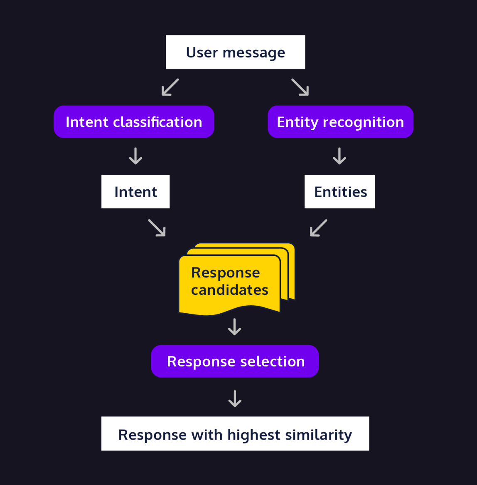

# Retrival Based ChatBot
A very simple closed domain chatbot. Sampling BOW and tf-idf natural Language processing approaches. 

## Table of Contents
- Installation
- Usage
- Contributing
- License

## Installation
!python -m spacy download en_core_web_sm
import pandas as pd
from collections import Counter
from nltk.stem import WordNetLemmatizer
import nltk
from nltk.tokenize import word_tokenize
from nltk.corpus import stopwords, wordnet
from nltk.stem.porter import PorterStemmer
from sklearn.feature_extraction.text import TfidfVectorizer
from sklearn.metrics.pairwise import cosine_similarity

## Usage

### Layout
- faq.csv: csv file containing Tags, Responses & triggers for Bot. 
- preprocessing.py: csv file processed. Classes defined for cleaning up all text. (Preprocess, Tokenize, POS Tag)
- chat.py: Class containing chat Functionality

